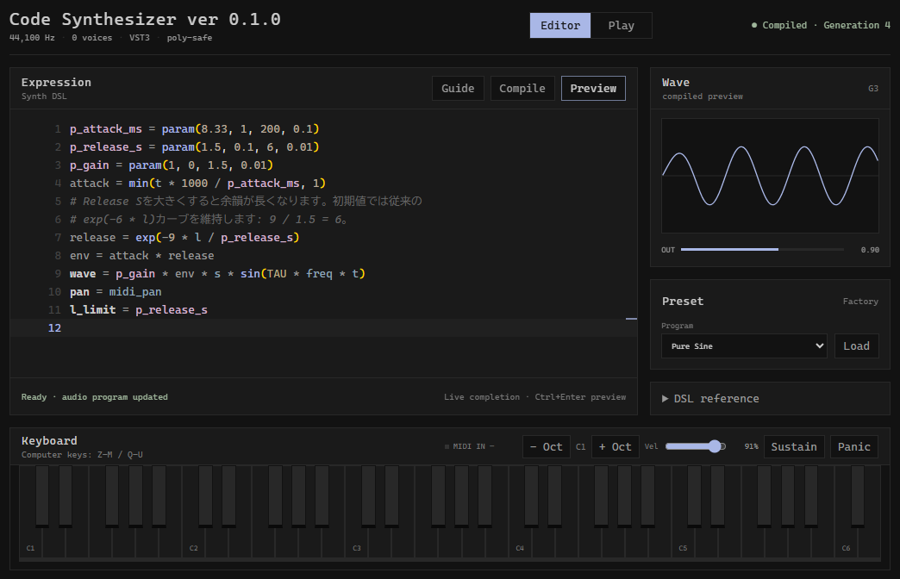
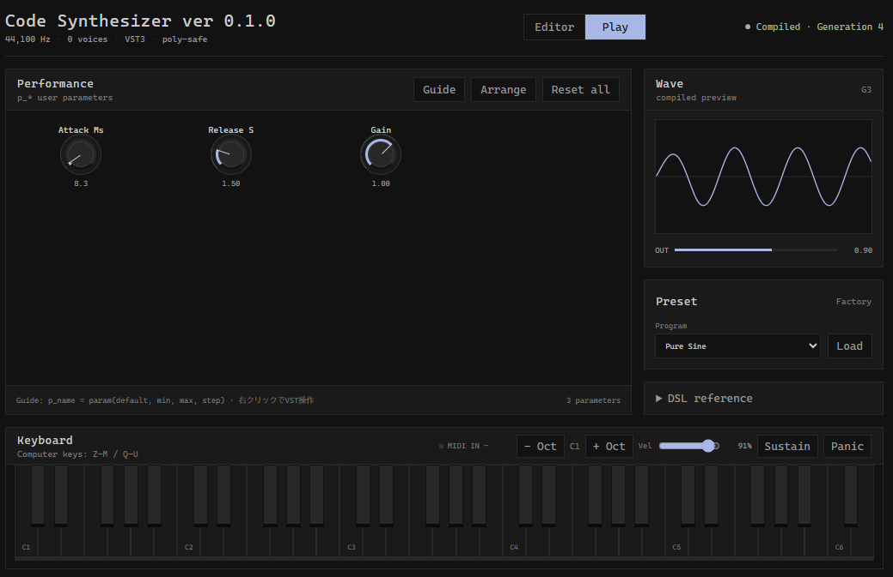
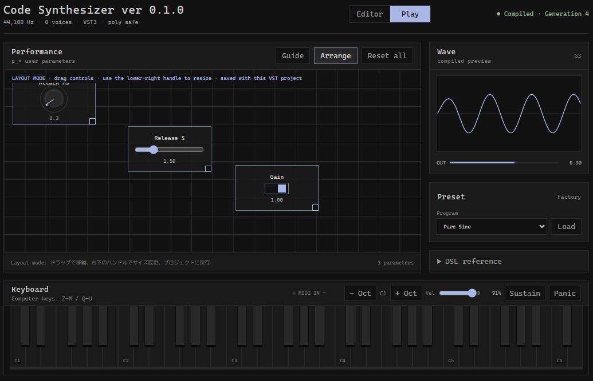
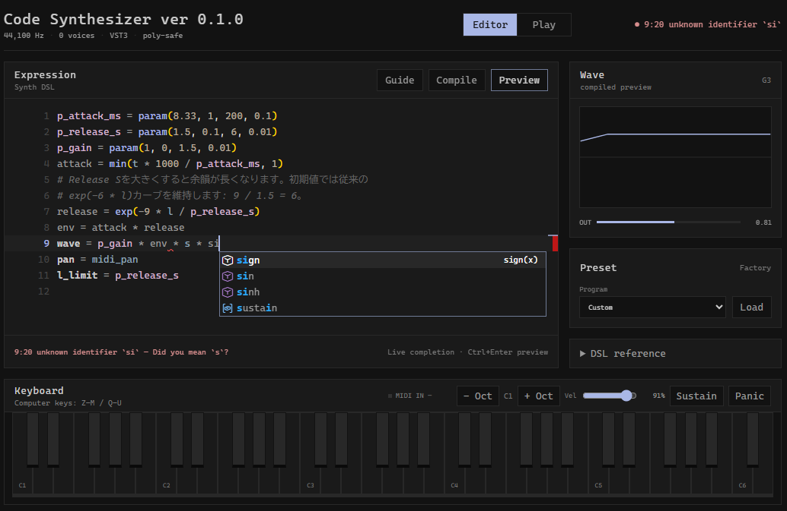

<div align="center">
<h1 style="font-size: 50px">Code Synthesizer</h1>

</div>

数式ベースの独自 DSL で音を定義し、編集内容を演奏中に反映できる Windows x86_64 向け Rust 製 VST3 シンセサイザーです。

- VST3 Instrument / Stereo Output
- 64 voice のポリフォニック SynthEngine
- MIDI Note On/Off、CC、Pitch Bend、Pressure、Sustain、Program Change
- MathSynth から引き継いだ Monaco / WebView2 UI と Editor / Play モード
- Lexer / Parser / Validator / Cranelift JIT backend を備えた DSL
- 非 RT スレッドでのコンパイルと Audio block 境界での hot reload
- phase lock 付き live 波形、プリセット、プレビュー鍵盤
- `p.*` ユーザーパラメータ、MIDI CC link、配置可能な knob / slider / toggle、VST3 automation
- `fn note` / optional `fn effect`、user function、true stereo、entrypoint分離persistent state、transactional `RingBuf`
- ソース、パラメータ値、Play レイアウト、画面モードを含む plugin state 保存・復元

## ギャラリー
<div style="display: grid; grid-template-columns: 1fr 1fr; gap: 16px; align-items: center;">




</div>

## 必要環境

- Windows x86_64
- 64-bit VST3 対応 DAW
- Rust 1.94 以上
- Node.js `^20.19.0` または `>=22.12.0`
- npm
- Microsoft Edge WebView2 Runtime (システムのWebViewでOk つまりLinux非対応)

このリポジトリでは Rust 1.97.1、Node.js 24.6.0、npm 11.5.1 で検証しています。

## ビルド

通常はリポジトリ直下で次だけを実行します。初回は UI 依存関係も自動で導入され、release VST3 バンドルまで生成されます。

```powershell
.\build.cmd
```

PowerShell から直接実行する場合:

```powershell
.\build.ps1                 # release bundle
.\build.ps1 -Dev            # debug bundle
.\build.ps1 -Test           # fmt + test + clippy + release bundle
.\build.ps1 -Install        # ユーザーVST3フォルダーへもコピー
.\build.ps1 -Smoke          # 5sのUIテスト
```

生成先:

```text
target/bundled/Code Synthesizer.vst3/
  Contents/
    x86_64-win/Code Synthesizer.vst3
    Resources/moduleinfo.json
```

`-Install` を使わない場合は、生成されたバンドルディレクトリを次へコピーします。

```powershell
$vst3Dir = "$env:LOCALAPPDATA\Programs\Common\VST3"
New-Item -ItemType Directory -Force $vst3Dir | Out-Null
Copy-Item -Recurse -Force "target\bundled\Code Synthesizer.vst3" $vst3Dir
```

こんなふうに。

その後、DAW で VST3 を再スキャンし、Instrument トラックへ `Code Synthesizer` を追加してください。

## Version と Release

version はルート `Cargo.toml` の `[workspace.package]` にある `version` だけを更新します。この値が全 crate、VST3 metadata、UI のタイトルと見出しに自動反映されます。

`main` または `master` へ push した際、GitHub Actions が直前の `Cargo.toml` と version を比較します。version が変わった場合だけ全テストと release buildを実行し、`v{version}` tag、GitHub Release、Windows x64 VST3 zipを生成します。通常のコード変更や、version以外の `Cargo.toml` 変更ではReleaseは作成されません。

## 使い方

プラグイン画面の Editor モードで DSL を編集すると、260 ms の debounce 後に自動コンパイルされます。成功したプログラムだけが Audio block 境界で DSP へ渡されるため、編集中に構文エラーがあっても直前の正常な音は継続します。Monaco には DSL 補完、snippet、hover、引数ヒント、コンパイラ marker、候補名の quick fix が入っています。

```text
note.out.layout = mono

p.attack_ms = param(8.33, 1, 200, 0.1)
p.release_s = param(1.5, 0.1, 6, 0.01)
p.gain = param(1, 0, 1.5, 0.01, 7)

fn note(in, p) -> out {
    attack = min(in.t * 1000 / p.attack_ms, 1)
    release = exp(-9 * in.l / p.release_s)
    out.wave = p.gain * in.s * in.vol * in.mexpr * attack * release
        * sin(TAU * in.freq * in.t)
    out.l_limit = p.release_s
}
```

`p.name = param(default, min, max, step, cc_link?)` は最初の `fn` より前に宣言します。最初の4値は必須、MIDI CC番号だけ省略可能です。Play modeとDAWにはautomation可能なparameterとして宣言順で公開されます。

Play の `Guide` では記法、意味の作り方、配置、automationを確認できます。`Arrange` 中はドラッグで移動、右下ハンドルでリサイズします。位置・大きさ・表示形式はプロジェクトに保存されます。右クリックでは reset、値の copy/paste、knob / slider / toggle の切替を行えます。

`Parameter Guide` はparameter、通常関数、qualified bundle、persistent scalar、stereo、RingBuf、post-mix effectをコメントで解説する実行可能なサンプルです。`note.out.layout = mono|stereo` を宣言し、effectを使う場合は `effect.in.layout` と `effect.out.layout` も明示します。mono noteだけが任意の `out.pan` を使えます。

Factory Presetsは32種類です。Basic、Lead、Pluck、Bass、Keys、Pad、Ensemble、Percussionなどの分類を内包したProgram menuから選択できます。基本音作り向けの`Basic Synth`と`SuperSaw`に加え、`Wavefold Lead`、`Glass Pluck`、`Resonant Bells`、`Lo-Fi Keys`、`Deep Space`、`Tape Echo`、`Phase Motion`、`Metal Drum`を収録しています。新しい音色ではKarplus-Strong、modal resonator、filter、multitap delay、reverb、waveshaperなどの標準DSPを実用例として使っています。

Preset panelのNameへ名前を入力して`Save`すると、現在のコード、parameter値、Play layoutを`Custom`分類へ保存できます。同名の保存は更新になり、CustomのLoadでは保存時の値と配置を復元します。Custom libraryはWebViewのlocal storageへ保存されます。

下部の鍵盤とPCキーはプレビュー用で、通常の DAW MIDI 入力も同じ SynthEngine へ送られます。Wave は発音中に audio callback の実出力を表示し、無音時はコンパイル済み式の静的プレビューへ切り替わります。モニターは余剰サンプルから連続フレームを切り出すため、右端で波形を循環させません。(循環させてひどい目にあった)

## DSL リファレンス

programには `note.out.layout = mono|stereo` とちょうど1つの `fn note(in, p) -> out` が必要です。`fn effect(in, p) -> out` を定義する場合は、その直前までに `effect.in.layout = mono|stereo` と `effect.out.layout = mono|stereo` を指定します。audio inputはnote mixへ加算されてからeffectへ入ります。

localはstatement順に再代入できます。比較はf32の0/1を返します。`#` と `//` は行コメントです。`2s`、`500ms`、`250us` の時間suffixと `k/m/u/g` のSI suffixを利用できます。

persistent scalarは初期値必須です。`note` call treeではVoice slotごとの`voice` storageだけを、post-mixの`filter` call treeではplugin instance共有の`global` storageだけを使用できます。RingBufはsample単位でtransactionalに動作します。

```text
f32 voice phase = 0
// fn effect(in, p) -> out 内でのみ宣言・使用可能
f32 global master = 1
RingBuf<f32, 180ms> global delay
```

完全一致するstorage schemaはhot reload後も維持され、sample rate変更時は全stateをresetします。ローカル、演算、storage、RingBuf容量には言語上の固定上限を設けず、負荷が大きい場合は `Warning` を表示します。parameterだけはVST automation slotとの同期のため最大32個です。

主要入力:

| 名前                                            | 内容                              |
| ----------------------------------------------- | --------------------------------- |
| `in.t` / `in.l` / `in.s`                        | Note On秒、Note Off秒、Velocity   |
| `in.freq` / `in.note` / `in.ch`                 | 周波数、MIDI note、MIDI channel   |
| `in.bend` / `in.bend_st`                        | Pitch Bend `-1..1`、半音換算値    |
| `in.mw` / `in.vol` / `in.midi_pan` / `in.mexpr` | CC 1 / 7 / 10 / 11                |
| `in.sustain` / pressure fields                  | Sustain / Channel / Poly Pressure |
| `in.program` / `in.cc(n)`                       | Program Change、任意 CC           |
| `in.sr` / transport fields                      | Sample rate / DAW transport       |
| `in.voice` / `in.rand`                          | Voice index / Voice固有乱数       |

出力:

| 名前                        | 内容                                                        |
| --------------------------- | ----------------------------------------------------------- |
| `note.out.layout = mono`    | `out.wave`、任意の `out.pan`、`out.l_limit`                 |
| `note.out.layout = stereo`  | `out.wave_l`、`out.wave_r`、`out.l_limit`。panは使用不可    |
| `effect.in.layout = mono`   | `in.wave`。note mix + audio inputのdownmix                  |
| `effect.in.layout = stereo` | `in.wave_l` / `in.wave_r`                                   |
| `effect.out.layout`         | monoなら `out.wave`、stereoなら `out.wave_l` / `out.wave_r` |

定数は `TAU`、`PI`、`E`、`PHI`、演算子は `+ - * / % ^` を使用できます。

関数:

```text
sin cos tan asin acos atan atan2 sinh cosh
exp sqrt cbrt abs tanh ln log log2 log10
floor ceil round fract sign
min max pow mod clamp mix step smoothstep select
mtof ftom dbtoa atodb cent_ratio semitone_ratio
saw square pulse triangle noise
```

RingBufの`peek` / `peek_linear` / `len` / `duration`、Biquad係数、Window、Filter、Delay、Physical Modeling、Modulation、Distortion、Dynamics、Smoothing、Stereo、Reverbを標準搭載しています。全signature、単位、bundle field、state domainは[DSL Standard Library](docs/dsl-standard-library.md)を参照してください。state付きDSPはcall siteごとにAudio thread外でmemoryを準備し、`note`ではVoice単位、`filter`ではglobalに動作します。

## 構成

```text
DAW
 └─ VST3 Adapter
     ├─ Processor: Audio / Event / SynthEngine
     ├─ Controller: Parameters / Automation / State
     └─ View: WebView2 / Monaco / IPC
                    │
                    └─ DSL Compiler
                         │ lock-free queue
                         ▼
SynthEngine ─ Voice Engine ─ Cranelift JIT Runtime
```

```text
crates/
  synth-core/   固定 voice、MIDI state、stereo DSP、program/parameter/waveform共有
  synth-dsl/    lexer、parser、validation、Cranelift IR/JIT backend
  synth-vst3/   VST3 component/controller/view/factory
  synth-ui/     WebView2、IPC、preset、waveform preview
ui/             Monaco ベース UI
presets/        DSL プリセット
xtask/          VST3 バンドル生成
```

VST3 ホストには Single Component として公開し、同じインスタンス内で Processor と Controller の状態を共有します。内部の責務と Audio/UI thread の境界は分離しています。

## RT-safe 方針

Audio callback 内では次を行いません。

- heap allocation / deallocation
- Mutex lock
- filesystem、WebView、JSON、DSL parsing
- program の破棄や重い初期化

Voice slotは固定容量です。UI threadがCraneliftのnative note/filter block kernelと各worker用runtimeを事前生成し、bounded lock-free queueへpublishします。Audio threadはblock先頭でruntimeを交換し、MIDI境界ごとに固定affinity workerへblock jobを1回ずつdispatchします。worker-local mixを番号順にreduceした後、main threadでglobal filter blockを処理します。旧programとworker runtimeは別queueへ返し、UI thread側で破棄します。`p.*` の値とoscilloscope ring bufferはatomicな固定容量storageで共有します。

## えとせとら

```powershell
npm run build --prefix ui
npm audit --prefix ui --audit-level=high
cargo test --workspace
cargo clippy --workspace --all-targets -- -D warnings
cargo xtask bundle --release
```

WebView2 だけを DAW 外で確認する場合:

```powershell
cargo run -p synth-ui --example ui-smoke
```

VST3 の UI lifecycle、WebView2 生成、asset 配信、Monaco 起動結果は次へ記録されます。

```text
%LOCALAPPDATA%\Code Synthesizer\ui.log
```

`CODE_SYNTH_UI_DEVTOOLS=1` を設定してから DAW を起動すると、エディター表示時に WebView2 DevTools も開きます。

## wiwiwi
standalone Web版と、semantic analyzerを直接利用するさらに高度なEditor refactoringは今後の拡張候補です。DSLとDSPコアはUI/VST3から独立しているため、Web版でも同じcompiler/runtimeを再利用できます。
